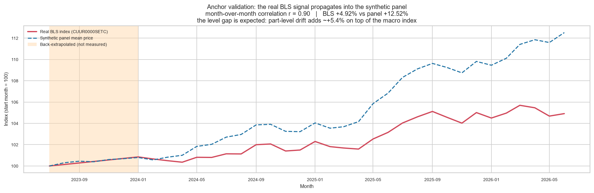
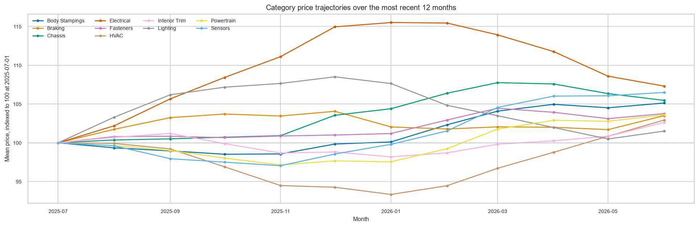
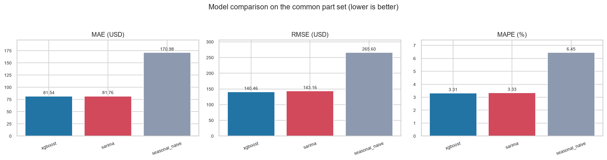
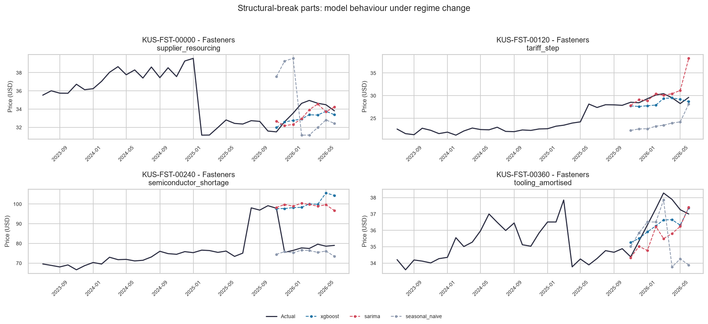
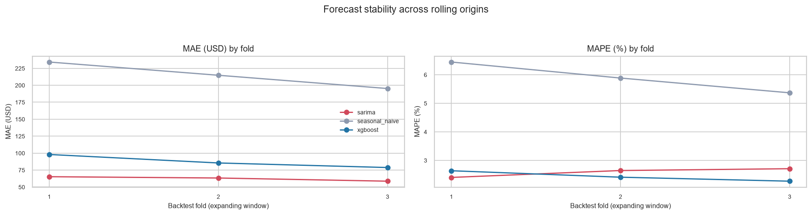
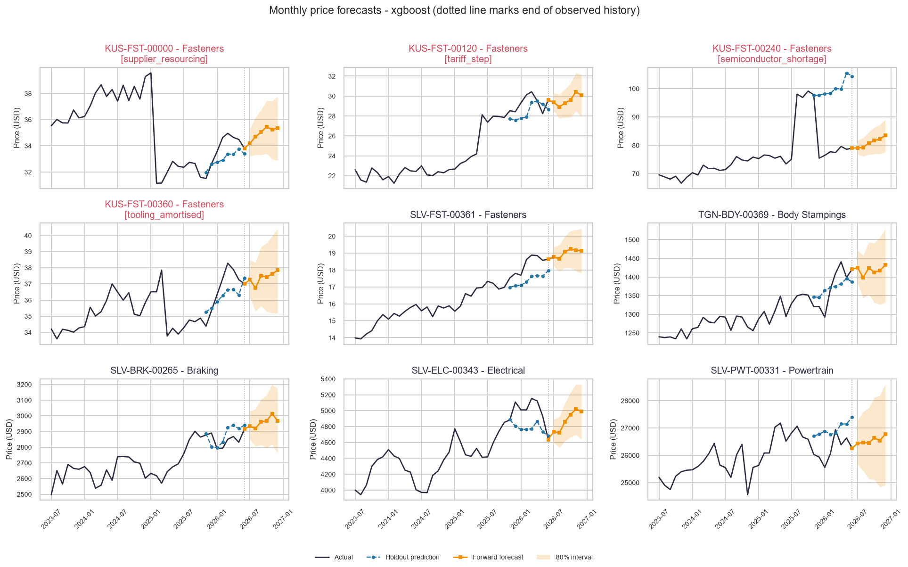

# Automotive Spare Parts - Monthly Price Forecasting (POC)

_Generated 2026-07-28 12:08 UTC_

---

## 1. Summary

End-to-end monthly price forecasting for **480 automotive spare parts** across **10 categories**, over **36 months** (2023-07-01 to 2026-06-01), producing **6-month forward forecasts** with prediction intervals.

### Does this actually work?

- **sarima** improves on seasonal-naive by **52.2%** MAE (81.76 vs 170.98 USD).
- **xgboost** improves on seasonal-naive by **52.3%** MAE (81.54 vs 170.98 USD).

Both learned models are measured against a seasonal-naive baseline (`price[t+h] = price[t+h-12]`). Without that comparison, an impressive-looking MAPE says nothing about whether the modelling added value.

---

## 2. Dataset

### 2.1 Sourcing decision

A search for a public dataset of **monthly prices per automotive SKU** came back empty. The full audit is in [`dataset_audit.md`](dataset_audit.md); in short:

- Kaggle automotive parts datasets are **cross-sectional** - attributes mapped to one price, with no date column and therefore nothing to forecast.
- Hyndman's `carparts` panel has the right shape but the wrong variable: intermittent **demand counts**, not prices.
- FRED carries suitable index series but was **unreachable** from this environment (repeated timeouts).
- The **BLS public API** does serve real monthly automotive price indices, with no API key - but only at **industry-aggregate level**, not per part.

So this POC uses a **hybrid**: the real BLS index drives the trend, and a synthetic SKU layer supplies the per-part structure that no public source offers. The boundary between real and simulated is stated explicitly rather than blurred.

| Property | Value |
|---|---|
| Anchor series | `CUUR0000SETC` |
| Retrieval path | `bls-cache` |
| Grounded in real data | **Yes** |
| Window | 2023-07-01 to 2026-06-01 |
| Back-extrapolated months | 6 |
| Total index change | +4.92% |

> **Caveat**: the BLS public API v1 returns roughly three years of history, leaving **6 month(s)** of the requested window uncovered. Those were extended backwards at the observed mean log drift rather than padded with a repeated value. They are synthetic and are shaded in the anchor-validation figure.




_Synthetic panel mean tracked against the real BLS index_


### 2.2 Generation methodology

Prices are built multiplicatively, because price shocks are proportional - a tariff moves a $240 alternator by more dollars than a $12 oil filter, but by the same percentage:

```
price[i,t] = base[i]                # lognormal, category-specific level
           * macro[t]               # REAL BLS index, normalised to 1.0
           * seasonal[i,t]          # category demand cycle
           * (1 + drift[i]) ** t    # part-specific supply-chain drift
           * exp(noise[i,t])        # AR(1) autocorrelated volatility
           * break[i,t]             # structural break, 4 parts only
```

Seasonality follows real aftermarket demand: batteries and starters peak in January when the first hard freeze exposes weak cells; cooling parts peak in July; suspension work follows the spring pothole season; filters are close to flat. Noise is AR(1) rather than white, so volatility clusters the way real price series do.

**4 parts carry deliberate structural breaks** to test robustness: a permanent supply-shock level shift, a tariff step, a price collapse after a new supplier enters, and a transient spike that reverts.

| Property | Value |
|---|---|
| Parts | 480 |
| Categories | 10 |
| Months of history | 36 |
| Total observations | 17,280 |
| Price range | $13.92 - $27176.06 |
| Random seed | 42 |

> **Why 36 months and not 12?** The brief asked for a year of history. A seasonal SARIMA with a 12-month cycle cannot be identified from 12 observations - it needs at least two full cycles - and an 80/20 split on 12 points leaves about 9 training rows, which is not enough to draw a conclusion from. History is therefore 36 months, while the dataset overview and category figures headline the most recent 12 months.




_Category price trajectories over the focus year_


### 2.3 Data quality handling

| rows_in | parts_in | missing_prices | imputed_by_ffill | unfillable_dropped | outliers_flagged | insufficient_history_parts | n_features | n_hierarchy_features | n_fx_features |
|---|---|---|---|---|---|---|---|---|---|
| 17280 | 480 | 177 | 177 | 0 | 14 | 0 | 80 | 8 | 38 |

Missing values are forward-filled within a part across gaps of at most 2 months; longer gaps are left as NaN and excluded rather than invented. Outliers are **flagged, not removed** - three of the four injected breaks are permanent level shifts, and smoothing them away would erase exactly the robustness test they exist to provide.

> **Scope note on outlier detection**: the MAD detector finds *point* outliers, and catches only the transient spike among the four anomalies. That is correct behaviour, not a miss - after a permanent level shift the new level becomes the local median, leaving nothing for a point test to see. Detecting permanent breaks is a separate problem (a level-shift test), out of scope here; model robustness to those breaks is measured directly in section 5.3 instead.

---

## 3. Modelling approach

### 3.1 Global model vs per-part models

**Chosen: one global XGBoost with part-level features**, alongside per-part SARIMA as a statistical comparator.

Each individual series holds only 36 monthly points - far too few to fit a per-part ML model without overfitting. Pooling all 480 parts yields ~17,280 rows and lets shared structure (category seasonality, the macro trend, brand price levels) be learned once and reused. It also handles thin-history and cold-start parts, and leaves one artifact to deploy instead of 480.

The trade-off is real: a global model smooths over part-specific idiosyncrasy. That is precisely what the per-part SARIMA recovers, which is why both are reported rather than one being declared the winner up front.

### 3.2 Direct vs recursive multi-step forecasting

**Chosen: direct.** One model per horizon h in 1..6, each mapping features at origin *t* to the price at *t+h*. Recursive forecasting would require regenerating lag features from the model's own predictions, compounding error with every step and adding a fragile feedback path. Direct costs 6x the training work, which at this scale is seconds.

### 3.3 Statistical vs ML - interpretability against accuracy

SARIMA is transparent (its order and coefficients are inspectable), supplies analytic prediction intervals, and models each series on its own terms - but it must be fit per part, cannot borrow strength across the panel, and is fragile on short histories.

XGBoost captures cross-part and non-linear structure and scales to thousands of SKUs from one artifact, but is opaque by comparison and has no native notion of a prediction interval - its bands here are empirical, derived from backtest residuals rather than assumed Gaussian.

### 3.4 SARIMA fit outcomes

SARIMA is fit through an explicit fallback ladder - seasonal SARIMA, then non-seasonal ARIMA, then random walk with drift - because a seasonal model on 36 observations will not always converge, and reporting a number without saying which model produced it would be misleading.

| fallback_level | parts |
|---|---|
| sarima | 60 |

> Stationarity and invertibility are **enforced**. Left unconstrained on ~28 training points, the estimated AR root can fall outside the unit circle and the forecast diverges exponentially - finite numbers, but economically absurd. A plausibility guard additionally rejects any forecast that strays outside 0.2x-5x the last observed price and demotes it down the ladder.

---

## 4. Evaluation design

Splits are **chronological, never random** - a random split on a time series leaks the future into training through neighbouring months and produces metrics that cannot be reproduced in deployment.

- **Train**: months 1-28
- **Test**: 6 months
- **Validation**: final 2 months, held out entirely

Training rows are filtered on **target month**, not feature month: a row at the training boundary with h=6 has its target six months later, inside the test window, and including it would leak.

> **Fair-comparison note**: SARIMA is fit per part and capped at `sarima.max_parts=60` for runtime, while XGBoost is global and covers every part. Scoring them over different part sets would make the comparison meaningless, so the headline table below restricts **all** models to the parts every model actually covered.

---

## 5. Results

### 5.1 Headline comparison (common part set)

| model | mae | rmse | mape | n | n_parts |
|---|---|---|---|---|---|
| xgboost | 81.542 | 140.460 | 3.314 | 480 | 60 |
| sarima | 81.756 | 143.155 | 3.334 | 480 | 60 |
| seasonal_naive | 170.979 | 265.605 | 6.447 | 480 | 60 |




_Model comparison on the common part set_


### 5.2 By split and horizon

| model | split | mae | rmse | mape | n |
|---|---|---|---|---|---|
| sarima | test | 80.164 | 139.872 | 3.263 | 360 |
| sarima | validation | 86.532 | 152.582 | 3.549 | 120 |
| seasonal_naive | test | 220.920 | 332.562 | 6.172 | 2880 |
| seasonal_naive | validation | 195.192 | 288.877 | 5.367 | 960 |
| xgboost | test | 109.193 | 177.416 | 3.064 | 2880 |
| xgboost | validation | 116.612 | 183.596 | 3.316 | 960 |

| model | horizon | mae | rmse | mape | n |
|---|---|---|---|---|---|
| sarima | 1 | 61.508 | 97.685 | 2.200 | 60 |
| sarima | 2 | 71.494 | 124.094 | 3.093 | 60 |
| sarima | 3 | 83.130 | 145.365 | 3.404 | 60 |
| sarima | 4 | 80.707 | 144.032 | 3.499 | 60 |
| sarima | 5 | 92.599 | 150.675 | 4.019 | 60 |
| sarima | 6 | 91.543 | 166.925 | 3.361 | 60 |
| seasonal_naive | 1 | 190.435 | 301.261 | 5.489 | 480 |
| seasonal_naive | 2 | 221.612 | 344.301 | 6.171 | 480 |
| seasonal_naive | 3 | 188.413 | 289.134 | 5.348 | 480 |
| seasonal_naive | 4 | 218.108 | 321.394 | 6.141 | 480 |
| seasonal_naive | 5 | 253.161 | 365.931 | 6.962 | 480 |
| seasonal_naive | 6 | 253.790 | 365.357 | 6.920 | 480 |
| xgboost | 1 | 64.137 | 109.118 | 1.724 | 480 |
| xgboost | 2 | 101.298 | 167.792 | 2.716 | 480 |
| xgboost | 3 | 114.760 | 192.300 | 3.060 | 480 |
| xgboost | 4 | 115.360 | 183.837 | 3.341 | 480 |
| xgboost | 5 | 124.677 | 185.369 | 3.758 | 480 |
| xgboost | 6 | 134.927 | 208.952 | 3.787 | 480 |

### 5.3 Robustness: structural-break parts vs normal parts

This is where the injected anomalies earn their place. Error on break parts should be visibly worse - if it were not, the breaks were too small to be a test of anything.

| model | is_anomaly_part | mae | rmse | mape | n |
|---|---|---|---|---|---|
| sarima | False | 87.191 | 148.154 | 2.926 | 448 |
| sarima | True | 5.666 | 10.225 | 9.054 | 32 |
| seasonal_naive | False | 216.257 | 323.547 | 5.936 | 3808 |
| seasonal_naive | True | 3.985 | 5.754 | 10.089 | 32 |
| xgboost | False | 111.933 | 179.729 | 3.082 | 3808 |
| xgboost | True | 5.688 | 10.770 | 8.520 | 32 |




_Model behaviour on the four structural-break parts_


### 5.4 Backtest stability

A single split on 36 months is easy to over-read. The rolling-origin backtest re-fits from 3 successive origins on an expanding window, so fold *k* never sees data that fold *k+1* introduces.

| model | mae_mean | mae_std | rmse_mean | rmse_std | mape_mean | mape_std |
|---|---|---|---|---|---|---|
| sarima | 62.396 | 3.395 | 101.235 | 6.459 | 2.584 | 0.161 |
| seasonal_naive | 214.718 | 19.522 | 315.180 | 25.700 | 5.899 | 0.540 |
| xgboost | 87.406 | 9.754 | 142.062 | 15.736 | 2.438 | 0.185 |




_Metric stability across rolling origins_


### 5.5 Prediction interval calibration

A stated 80% interval is only useful if it actually contains the truth about that often. Measured empirical coverage:

| model | empirical_coverage_pct |
|---|---|
| sarima | 60.625 |

> **sarima intervals are too narrow**: 60.6% achieved against 80% nominal. SARIMA's analytic intervals propagate residual variance but not parameter-estimation uncertainty, which is material on a series this short. Treat them as optimistic.

---

## 6. Forward forecasts

**6 months** beyond the end of history, from every model, refit on the complete series - withholding the final months from the model that ships would mean deploying something weaker than what was measured.

- Output: `data/processed/forecasts.csv` (6,120 rows, 480 parts)
- Horizon: 2026-07-01 to 2026-12-01

XGBoost intervals are **empirical**, taken from the distribution of backtest residuals expressed as ratios to the prediction (so the band scales with price level), and widened past the backtest horizon by a square-root-of-time rule. SARIMA intervals are analytic.




_Side-by-side forecasts: history, holdout predictions, and forward forecast with intervals_


---

## 7. Limitations

Stated plainly, because a POC that oversells itself is worse than one that does not:

1. **The SKU layer is synthetic.** Only the macro trend is real. Absolute error figures describe how well the models recover a known generative process - not how they would perform on real supplier price feeds. The relative ranking of models is the transferable result; the MAPE value is not.
2. **36 months is a short series.** Three seasonal cycles is the minimum for identifying annual seasonality, not a comfortable amount. Seasonal estimates carry wide uncertainty.
3. **Prediction intervals are optimistic**, measurably so - see section 5.5.
4. **No exogenous drivers** beyond the price index. Real spare-parts pricing responds to commodity costs, freight rates, FX and vehicle parc age, none of which are modelled here.
5. **Structural breaks are not detected, only survived.** There is no changepoint detection; the models simply absorb breaks with degraded accuracy, quantified in section 5.3.
6. **SARIMA covers 60 parts, not all 480**, for runtime. Fine for a POC; a production system would need parallel fitting or a hierarchical approach.

---

## 8. Reproducibility

Seeded with `random_seed=42`; regenerating the dataset produces a byte-identical CSV. Every tunable lives in `config.yaml` - no thresholds are hardcoded in the modules.

| Package | Version |
|---|---|
| matplotlib | 3.11.1 |
| numpy | 2.2.6 |
| pandas | 2.3.3 |
| python | 3.11.9 |
| scipy | 1.16.3 |
| seaborn | 0.13.2 |
| sklearn | 1.8.0 |
| statsmodels | 0.14.6 |
| xgboost | 3.2.0 |
| yaml | 6.0.2 |

```bash
pip install -r requirements.txt
python -m price_forecasting.pipeline --config config.yaml --stage all
```
